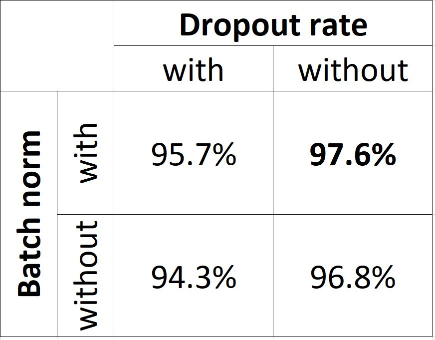
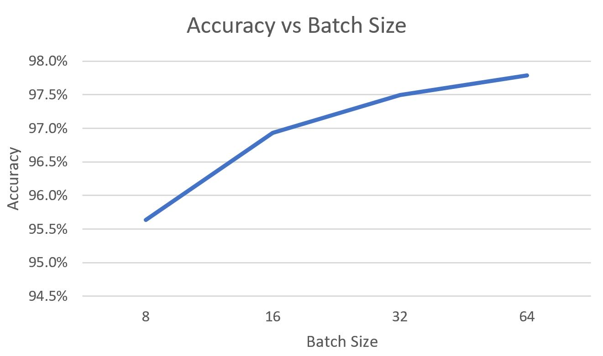
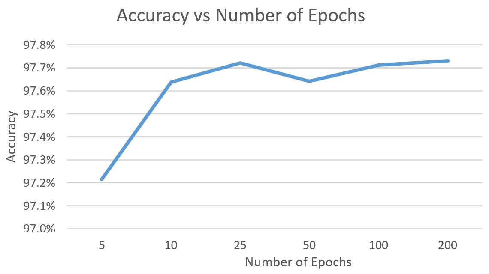

# Matching Networks Tensorflow Implementation

## Introduction

This is an implementation of Matching Networks as described in https://arxiv.org/abs/1606.04080.
The implementation provides data loaders, model builders, model trainers and model savers for the Omniglot dataset. Furthermore the data loader provider can be used on any dataset, of any size, as long as you can provide it in the folder structure outlined below.

## Installation

To use the Matching Networks repository you must first install the project dependencies. This can be done by install miniconda3 from <a href="https://conda.io/miniconda.html">here</a>
 with python 3.6 and running:

```pip install -r requirements.txt```


## Getting the data ready
The code in the [training script](https://github.com/AntreasAntoniou/MatchingNetworks/blob/master/train_one_shot_learning_matching_network.py)
 uses a data provider that can build a dataset directly from a folder that contains the data.
 The folder structure required for the data provider to work is:
```
 Dataset
    ||______
    |       |
 class_0 class_1 ... class_N
    |       |___________________
    |                           |
samples for class_0    samples for class_1

```
Once a dataset in the above form is build then simply using:
```
data = dataset.FolderDatasetLoader(num_of_gpus=num_gpus, batch_size=batch_size, image_height=28, image_width=28,
                                   image_channels=1,
                                   train_val_test_split=(1200/1622, 211/1622, 211/162),
                                   samples_per_iter=1, num_workers=4,
                                   data_path="path/to/dataset", name="dataset_name",
                                   index_of_folder_indicating_class=-2, reset_stored_filepaths=False,
                                   num_samples_per_class=samples_per_class, num_classes_per_set=classes_per_set)
```
Will allow one to built a data loader for Matching Networks. The data provider can be used as demonstrated in the [experiment script](https://github.com/AntreasAntoniou/MatchingNetworks/blob/master/experiment_builder.py).

Sampling from the data loader is as simple as:
```
for sample_id, train_sample in enumerate(self.data.get_train_batches(total_batches=total_train_batches,
                                                                            augment_images=self.data_augmentation))
```
The data provider uses parallelization as well as batch sampling while tensorflow is training a step, such that there is minimal waiting time between loading a batch and passing it to tensorflow.

## Training a model
To train a model simply use arguments on the training script, for example to do a 20 way 1 shot experiment on omniglot without full context embeddings run:

```
python train_one_shot_learning_matching_network.py --batch_size 32 --experiment_title omniglot_20_1_matching_network --total_epochs 200 --full_context_unroll_k 5 --classes_per_set 20 --samples_per_class 1 --use_full_context_embeddings False --use_mean_per_class_embeddings False --dropout_rate_value 0.0

```

## Results
Our Results can be found on [this](https://mcgill-my.sharepoint.com/:f:/g/personal/muhammad_sumbal_mail_mcgill_ca/EiKQfrICLzlKvHpZUxID_HQBbvf0Dssw_81-ZVI_xRhADg?e=6nwhMG) oneDrive link.

Here are some charts and tables of our results.





## Features
The code supports automatic checkpointing as well as statistics saving.
 It uses 1200 classes for training, 211 classes for testing and 211 classes for validation. We save the latest 5 trained models as well as keep track
 of the models that perform best on the validation set. After training all epochs, we take the best validation model
 and produce test statistics.
 Furthermore the number of classes and samples per class can be modified and the code will be able to handle any
 combinations that do not exceed the available memory. As an additional feature we have added support for full context
 embeddings in our implementation.

Our implementation uses the omniglot dataset, but one can easily add a new data provider and then build a new
experiment by passing the data provider to the ExperimentBuilder class and the system should work with it, as long as
 it provides the batches in the same way as our data provider, more details can be found in data.py

We've also very recently introduced the Full Context Embeddings version of matching networks properly implemented as
explained in the paper. Please don't hesitate to ask questions.

## Acknowledgements
Special thanks to https://github.com/zergylord for his Matching Networks
 implementation of which parts were used for this implementation. More
  details at https://github.com/zergylord/oneshot

Additional thanks to my colleagues https://github.com/gngdb,
 https://github.com/ZackHodari and https://github.com/artur-bekasov
  for reviewing my code and providing pointers.
